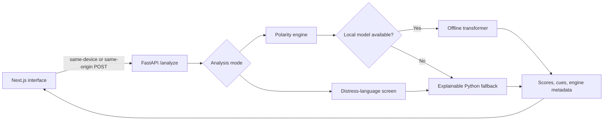

# Toneleaf

Toneleaf is a privacy-conscious sentiment and emotional-language analysis application. A calm Next.js interface sends text to a Python NLP engine that produces positive, neutral, negative, supportive, and distress-related language signals with visible cues and explanations.

The application can run entirely on one device or as a single stateless web container. It does not use a third-party inference API, application database, account system, analytics identity, or request-body logging.

> Toneleaf supports reflection and language screening. It is not a clinical, safety, moderation, employment, legal, or emergency decision system.

## Highlights

- Python sentiment analysis with negation, intensifiers, phrases, insults, threats, and violence-language coverage.
- Separate self-distress screening so a directed threat is not presented as evidence of the speaker's mental-health condition.
- Optional offline Hugging Face transformer inference from model files already stored on the machine.
- Explainable results with signal shares and influential words or phrases.
- Text, local document, editable voice transcript, and pasted social-content workflows.
- No persistent text history: recent analyses remain only in page-session memory.
- One-container production build with the exported Next.js interface served by FastAPI.
- An executed analysis notebook with tables, charts, and a 42-sentence polarity evaluation.

## Verified behavior

Toneleaf includes a curated smoke corpus covering positive, neutral, negative, negated, insulting, threatening, and distress-related language.

| Evaluation | Result |
| --- | ---: |
| Polarity sentences | 42 / 42 |
| Distress-screening sentences | 6 / 6 |
| Total labelled examples | 48 / 48 |

These results are regression coverage for the included examples, not a claim of universal or population-level accuracy. Sarcasm, coded language, cultural nuance, and long conversational context can still produce incorrect results.

## Architecture



The default local development setup uses:

- interface: `http://127.0.0.1:3000`
- private Python API: `http://127.0.0.1:8765`

Production serves the browser and Python API from one origin. Vercel uses a
Python Function under `/api`; the container serves both on port `8080`.

## Privacy modes

| Mode | Where text is processed | Privacy boundary |
| --- | --- | --- |
| Device-local | Python on the user's computer | Strongest option. Text does not leave the device. |
| Hosted container | Operator-controlled FastAPI service | Text travels over HTTPS and exists transiently in server memory. It is not persisted or sent to a model provider. |

In both modes, Toneleaf disables API access logs, applies `Cache-Control: no-store`, uses no application database, and retains browser history only until the page reloads. Hosted operators must enable HTTPS through their deployment platform.

Browser speech recognition may use a browser or operating-system speech provider. For sensitive material, paste a transcript produced locally instead. See [PRIVACY.md](PRIVACY.md) for the threat-model boundary.

## Technology

| Technology | Purpose |
| --- | --- |
| Python 3.10+ | NLP scoring, normalization, cues, and distress screening |
| FastAPI and Pydantic | Local/hosted API, validation, input limits, and privacy headers |
| Transformers and PyTorch (optional) | Offline deep-learning inference from local model files |
| Next.js 16 and React 19 | Responsive application interface and static production export |
| pandas and matplotlib | Notebook evaluation, tables, and charts only |
| Docker | Reproducible single-container production deployment |

## Run locally

### 1. Python API

From PowerShell:

```powershell
cd C:\Users\Saanvi\Downloads\Sentiment
python -m venv .venv
.\.venv\Scripts\Activate.ps1
python -m pip install -r requirements.txt
python -m backend.run
```

From Command Prompt, activate with `.venv\Scripts\activate.bat` instead.

Verify the service at [http://127.0.0.1:8765/health](http://127.0.0.1:8765/health). The response should be:

```json
{"status":"ok","privacy":"local-memory-only"}
```

### 2. Next.js interface

Open a second terminal:

```powershell
npm install
npm run dev
```

Open [http://127.0.0.1:3000](http://127.0.0.1:3000). Keep both terminals running.

## Optional offline deep-learning model

The default Python fallback is deterministic and explainable. To use a compatible three-label Hugging Face sentiment model already downloaded to the machine:

```powershell
python -m pip install -r requirements-ml.txt
$env:TONELEAF_MODEL_PATH = "C:\models\sentiment-model"
python -m backend.run
```

Toneleaf calls `from_pretrained(..., local_files_only=True)`. It never downloads a model during analysis and falls back safely when the local model cannot be loaded.

## Sentiment-analysis notebook

The executed notebook is available at [notebooks/Toneleaf_Sentiment_Analysis.ipynb](notebooks/Toneleaf_Sentiment_Analysis.ipynb). It contains:

- representative positive, neutral, negative, insulting, threatening, and negated examples;
- an explainable score table and stacked signal-share chart;
- evaluation over 42 labelled polarity sentences;
- a confusion matrix and per-class summary;
- separate distress-screening demonstrations;
- responsible-use and privacy limitations.

Install its optional dependencies and execute it with:

```powershell
python -m pip install -r requirements-notebook.txt
jupyter execute notebooks\Toneleaf_Sentiment_Analysis.ipynb --inplace
```

## Tests

Run the dependency-free engine and evaluation suite:

```powershell
python -m unittest discover -s tests -v
```

The labelled cases live in `tests/evaluation_cases.py`, so vocabulary or scoring changes are checked against the same corpus.

## Production deployment

### Vercel

The repository includes `api/index.py` and `vercel.json`. Vercel deploys the
Next.js interface and FastAPI together, with analysis available at
`/api/analyze`. No separate backend URL or environment variable is required.

1. Push the latest commit to the connected GitHub repository.
2. Let Vercel redeploy the `main` branch.
3. Verify `/api/health` on the production domain.
4. Force-refresh the website and run a sample analysis.

Hosted text is processed transiently in Vercel Function memory. It is not sent
to an external model API or stored by Toneleaf, but this is not the same privacy
boundary as device-local mode.

### Docker

Build and run the complete application:

```powershell
docker build -t toneleaf .
docker run --rm -p 8080:8080 toneleaf
```

Open [http://127.0.0.1:8080](http://127.0.0.1:8080). The image:

1. builds the Next.js static export;
2. installs only production Python dependencies;
3. copies the interface into the FastAPI runtime;
4. runs as an unprivileged user;
5. exposes a container health check at `/health`;
6. serves the UI and API from the same origin.

### Render Blueprint

The included `render.yaml` uses the Dockerfile directly:

1. Push the repository to GitHub.
2. In Render, choose **New → Blueprint**.
3. Select the repository and approve the `toneleaf` service.
4. After deployment, verify `/health` and run a sample analysis.

Render or another container platform should terminate HTTPS before public traffic reaches the application. No secret is required for the default engine.

### Deployment environment variables

| Variable | Default | Purpose |
| --- | --- | --- |
| `TONELEAF_HOST` | `127.0.0.1` | API bind host; Docker sets `0.0.0.0` |
| `TONELEAF_PORT` | `8765` | Explicit API port override |
| `PORT` | unset | Platform-assigned port fallback; Docker defaults to `8080` |
| `TONELEAF_STATIC_DIR` | unset | Exported frontend directory served by FastAPI |
| `TONELEAF_TRUSTED_HOSTS` | `127.0.0.1,localhost` | Comma-separated allowed Host headers |
| `TONELEAF_MODEL_PATH` | unset | Existing local transformer model directory |
| `NEXT_PUBLIC_TONELEAF_API` | production: `/api` | Browser API base; `.env.development` selects local port `8765` |

## API

`POST /analyze`

```json
{
  "text": "The meal was delicious and the staff were friendly.",
  "mode": "polarity"
}
```

Example response:

```json
{
  "scores": {"positive": 79, "neutral": 21, "negative": 0},
  "label": "positive",
  "cues": ["delicious", "friendly"],
  "confidence": 79,
  "engine": "python-local-lexicon",
  "privacy": "local-memory-only"
}
```

Valid modes are `polarity` and `distress`. Text is required and limited to 5,000 characters.

## Project structure

| Path | Responsibility |
| --- | --- |
| `app/page.jsx` | Toneleaf interface and browser workflows |
| `app/lib/api.js` | Local-development or same-origin API connection |
| `backend/engine.py` | Python NLP, offline transformer adapter, and distress screen |
| `backend/main.py` | FastAPI routes, validation, security headers, and static serving |
| `backend/run.py` | Environment-aware local/container server entry point |
| `api/index.py` | Vercel Python Function entry point |
| `tests/evaluation_cases.py` | Human-labelled 48-example smoke corpus |
| `tests/test_engine.py` | Focused engine regression tests |
| `tests/test_evaluation.py` | Whole-corpus assertions |
| `notebooks/Toneleaf_Sentiment_Analysis.ipynb` | Executed analysis and visualization notebook |
| `Dockerfile` | Multi-stage single-container production build |
| `render.yaml` | Render Blueprint configuration |
| `vercel.json` | Vercel Python Function bundle configuration |
| `PRIVACY.md` | Detailed privacy and threat-model documentation |

## Limitations and responsible use

- Signal shares are deterministic scores, not calibrated probabilities.
- Keyword and phrase coverage cannot fully understand sarcasm, coded speech, culture, or personal history.
- Distress wording does not prove a mental-health condition.
- Missing distress cues do not guarantee that someone is safe.
- Directed violence is treated as negative polarity but is not automatically labelled self-distress.
- Important decisions require human context and appropriate professional judgment.
- If someone may be in immediate danger, contact local emergency services or an appropriate crisis-support service.

## Author

**Saanvi Grover**

## License

Licensed under the [Apache License 2.0](LICENSE).
