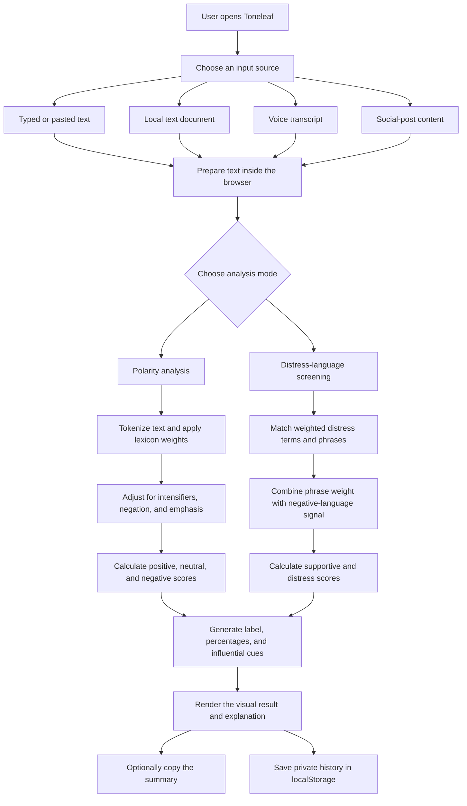

# Toneleaf

Toneleaf is a privacy-focused emotional language analysis application designed to help people understand the tone behind written communication. It converts text into approachable positive, neutral, negative, mixed, and distress-related signals while keeping the analysis transparent and easy to interpret.

Instead of returning only a label, Toneleaf explains the result through percentage-based signal breakdowns, detected language cues, contextual guidance, and a short human-readable summary. The application is intended for reflection, communication awareness, and early language screening—not clinical diagnosis.

## Project purpose

Written language often carries emotional context that is easy to miss, especially in messages, reviews, feedback, support conversations, and social posts. Toneleaf provides a calm interface for exploring that context without requiring an account, uploading content to a remote analysis service, or exposing private text to a third-party API.

The project focuses on four principles:

- **Privacy:** analysis happens locally in the browser.
- **Clarity:** results show individual signal percentages and influential words.
- **Context:** mixed language is presented as mixed instead of being forced into an overly confident label.
- **Accessibility:** the experience works across desktop and mobile layouts with light and dark themes.

## Core features

### Multiple input sources

Toneleaf provides four ways to prepare language for analysis:

- **Text:** type or paste messages, reviews, feedback, journal entries, or any other written content.
- **Documents:** read local TXT, Markdown, CSV, and JSON files directly in the browser.
- **Voice transcripts:** use supported browser speech recognition or manually edit the generated transcript.
- **Social content:** paste posts, captions, or comments without connecting a social-media account.

### Polarity analysis

The polarity engine produces positive, neutral, and negative percentages. It considers:

- weighted emotional words;
- common intensifiers such as “very,” “really,” and “absolutely”;
- nearby negation such as “not,” “never,” and “cannot”;
- punctuation emphasis from exclamation marks;
- a neutral baseline for factual or emotionally ambiguous language.

When the leading score is weak or the strongest signals are close together, Toneleaf describes the result as **mixed, leaning positive**, **mixed, leaning neutral**, or **mixed, leaning negative**. This avoids presenting uncertain language as a definitive judgment.

### Distress-language screening

The distress check looks for explicitly weighted phrases associated with hopelessness, isolation, exhaustion, self-harm, and other high-risk emotional language. It also considers the negative polarity score when calculating the final supportive-versus-distress signal.

This feature is intentionally presented as a screening signal. It cannot determine a person’s mental-health condition and is not a substitute for professional assessment, crisis support, or emergency services.

### Explainable results

Every completed analysis can include:

- a primary signal and signal-share percentage;
- a visual breakdown of every calculated category;
- the strongest detected words or phrases;
- a plain-language explanation of what influenced the result;
- a copyable summary for personal use;
- a private recent-analysis history stored in the browser.

## How Toneleaf works



## Application architecture

Toneleaf uses a client-first architecture. The interface, input handling, analysis logic, theme preference, and history storage all operate within the user’s browser.

```text
User input
   ↓
React interface and browser APIs
   ↓
Local sentiment or distress analysis
   ↓
Scores, cues, explanation, and visual result
   ↓
Optional browser-only history and clipboard summary
```

There is no application database, user-authentication system, remote sentiment API, or server-side storage layer. This keeps the deployment lightweight and reduces the amount of personal data the application needs to handle.

## Technology stack

| Technology | Role in the project |
| --- | --- |
| **Next.js 16** | Application framework, App Router structure, metadata, static optimization, and Vercel-ready production builds |
| **React 19** | Interactive components, state management, analysis modes, history drawer, themes, and user actions |
| **JavaScript / JSX** | Interface behavior, input processing, browser integration, and sentiment-analysis logic |
| **CSS3** | Responsive layouts, pink-and-blue design system, dark mode, animations, focus states, and result visualization |
| **Web Speech API** | Browser-supported voice transcription for the voice input workflow |
| **File API** | Local reading of supported text documents without uploading them to a server |
| **Clipboard API** | Copying a concise analysis summary from the result panel |
| **localStorage** | Saving theme preference and recent analysis history on the user’s device |
| **Vercel** | Intended hosting platform for the optimized Next.js application |

The project deliberately avoids a heavy component library, external AI endpoint, database, and authentication provider. The interface and analysis experience remain compact, understandable, and inexpensive to deploy.

## Analysis design

### Polarity scoring pipeline

1. Input is converted to lowercase and tokenized.
2. Recognized emotional terms receive positive or negative weights.
3. Intensifiers increase the nearby word’s weight.
4. Negators reverse and soften nearby sentiment.
5. Exclamation marks contribute limited emphasis to the strongest direction.
6. A neutral baseline prevents every sentence from being treated as strongly emotional.
7. Values are normalized into percentages totalling 100.
8. The strongest weighted words are returned as contextual cues.
9. Low-confidence or closely competing results receive a mixed label.

### Distress screening pipeline

1. The text is checked for weighted distress-related words and multi-word phrases.
2. Repeated matches contribute to an accumulated language-risk value.
3. Strong negative polarity can increase that value.
4. The final result is limited to a bounded percentage range.
5. The interface presents supportive and distress signal shares alongside the detected cues and a safety disclaimer.

The scoring approach is deterministic and explainable: the same input produces the same result, and the interface can show which language affected the outcome. It is a language heuristic rather than a trained medical or diagnostic model.

## Privacy model

Toneleaf is designed around browser-local processing:

- typed and pasted content is analyzed in memory;
- selected documents are read locally with the browser File API;
- analysis history is saved only in the current browser’s local storage;
- history can be cleared from inside the application;
- no text is intentionally sent to an external sentiment service;
- no API key, account, analytics identity, or application database is required.

Browser speech recognition availability and processing behavior depend on the browser and operating environment. Users should review their browser’s speech-service privacy behavior before using voice transcription for sensitive content.

## Interface and visual design

Toneleaf uses a soft pink, powder-blue, and muted-violet color system intended to feel calm rather than clinical. The interface includes:

- a custom Toneleaf identity and application icon;
- an original illustrated landing experience;
- focused input and result panels;
- responsive desktop and mobile layouts;
- light and dark color themes;
- consistent vector navigation icons;
- keyboard-visible focus styling;
- animated score tracks and clear category colors;
- empty, active, result, history, and notification states.

## Project structure

| Path | Responsibility |
| --- | --- |
| `app/page.jsx` | Main Toneleaf interface, interactions, browser APIs, source selection, analysis flow, and result presentation |
| `app/lib/sentiment.js` | Polarity lexicon, weighting rules, tokenization, mixed signals, and distress-screening calculations |
| `app/layout.jsx` | Application metadata, global stylesheet loading, viewport configuration, and root layout |
| `app/soft-theme.css` | Toneleaf visual system, responsive layout, light and dark themes, and accessibility-focused styling |
| `app/overrides.css` | Small targeted component and result-state overrides |
| `public/assets/` | Original visual assets used by the landing experience |
| `next.config.mjs` | Production-oriented Next.js configuration |

## Deployment model

The application is structured for deployment as a Next.js project on Vercel. Its main route is statically optimized during the production build, and the browser performs the interactive analysis after the page loads. Because the current application does not depend on a backend, database, or secret API credentials, it does not require deployment environment variables.

## Limitations and responsible use

- Language is complex, and keyword-based scoring cannot fully understand sarcasm, culture, personal history, or conversational context.
- Percentages represent deterministic language signals, not scientifically calibrated probabilities.
- Distress-related wording does not prove that a person has a mental-health condition.
- The absence of detected distress terms does not guarantee that a person is safe or emotionally well.
- Important decisions should never be made using Toneleaf alone.
- If someone may be in immediate danger, contact local emergency services or an appropriate crisis-support service.

## Author

**Saanvi Grover**

Toneleaf was designed and developed as a modern, privacy-conscious exploration of explainable sentiment analysis and thoughtful emotional-language interfaces.

## License

This project is distributed under the **Apache License 2.0**. See the `LICENSE` file for the complete license terms.
